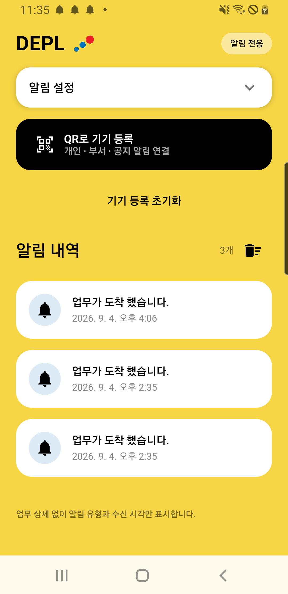
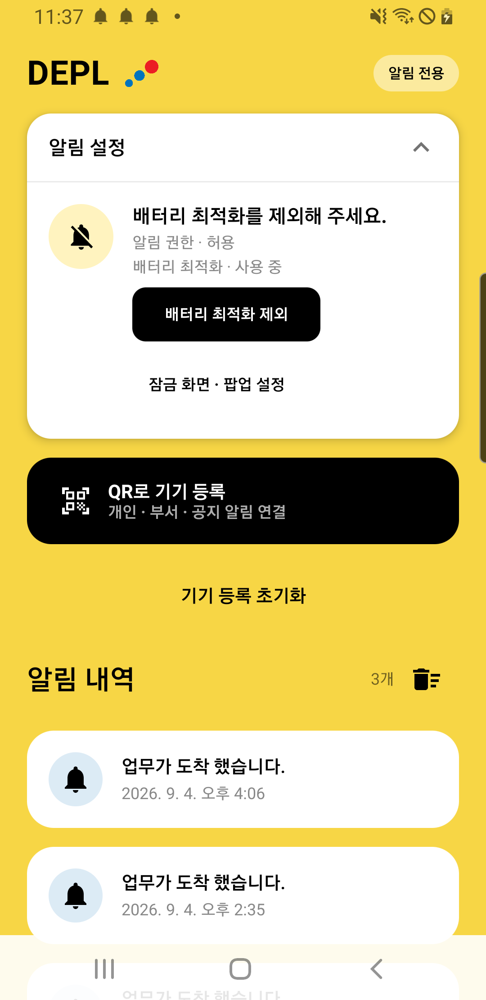
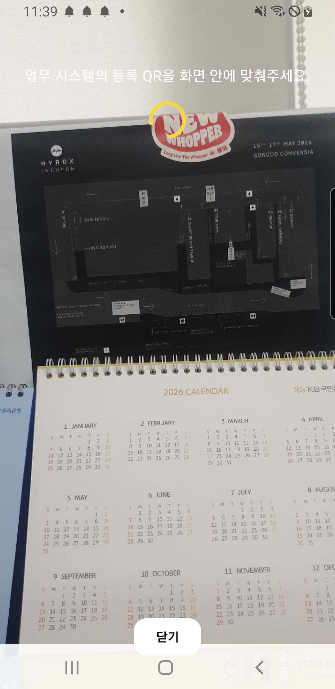

# DEPL Android User Guide

## Getting started

Use the main screen to register with a QR code and review notifications saved on your phone.

### 1. Check your internet connection

Open the company-provided DEPL app and connect to Wi-Fi or mobile data. The app uses Firebase; it does not connect directly to the Gateway on your company's private network.

### 2. Open device registration

Tap the black “QR로 기기 등록” button (Register device with QR) to connect personal notifications, department notifications and company-wide announcements. “기기 등록 초기화” (Reset device registration) is a separate action; do not tap it to begin registration.

### 3. Review notification history

“알림 내역” means Notification history. Messages and their recorded times are listed newest first. The number on the right is the saved entry count. Scroll for older entries. View and complete the underlying work in the business system, not in DEPL.

### The trash icon is not a refresh button

The trash icon beside the history heading deletes all locally saved entries after you confirm. The app cannot restore deleted history from the server.

<!-- pagebreak -->

## Check notification settings

Tap “알림 설정” (Notification settings) to expand the card; tap it again to collapse it.

### 1. Notification permission

Check permission in Android's app notification settings as well. Android 13 and later may display a notification permission prompt. The captured phone runs Android 10, so it does not show that same prompt.

### 2. Battery optimization

If the status is “사용 중” (In use), tap “배터리 최적화 제외” (Exclude from battery optimization). Read the system prompt and choose whether to allow the exemption. If the status is already “제외됨” (Excluded), no change is needed.

### 3. Lock Screen and pop-ups

“잠금 화면 · 팝업 설정” (Lock Screen / pop-up settings) opens system notification settings. Check content visibility, sound, vibration and notification channels. Silent mode, Do Not Disturb and power-saving settings can also affect notifications.

### Check both the app and system settings

An “Allowed” label in DEPL does not guarantee that every channel, sound or Lock Screen setting is enabled. Menu names, pop-up behavior and whether the screen wakes depend on the manufacturer and Android version.

<!-- pagebreak -->

## Scan and confirm registration

Display your own QR code in the business system and scan it with DEPL's camera.

### 1. Obtain a current QR code

Request a QR code for your own user account and actual department. The current default validity period is 3 minutes, with a maximum of 10 minutes. Your company's issuance settings may differ.

### 2. Scan the entire code

Allow camera access if needed. Keep the entire QR code visible and wait for validation and subscription to finish. If the code has expired, request a new one and scan again. Do not use another person's QR code or share your QR image.

### 3. Confirm completion

Look for “기기 등록 완료” (Device registration complete) and the message confirming readiness for personal, department and announcement notifications. Tap “확인” (OK). Ask an administrator to send a test notification to you and check both the system notification and in-app history.

### This screenshot shows the scanning step

The completion message is described from the current source code, not from a captured success dialog. No new registration, test send or subscription reset was performed to create this guide.

<!-- pagebreak -->

## History and troubleshooting

Saved notification history and device registration are managed separately.

### Retain 3,000 entries; load the list in batches of 30

The current source code stores the latest 3,000 entries in the device database and removes older entries beyond that limit. Thirty is the list-loading batch size, not the retention limit. Duplicate event IDs are not saved again; identical wording with different event IDs represents separate notifications.

### Deleting history is different from resetting registration

After confirmation, the trash icon deletes saved history. Reset device registration unsubscribes the device from notification topics, so a new QR registration is needed afterward. Server history recovery is not available. Before uninstalling the app or clearing its data, ask your administrator about recovery options. Request a new QR code when changing department or phone.

### Camera unavailable

Check DEPL's camera permission in system settings.

### Expired QR code or signature error

Request a new code. If the error persists, ask your administrator to verify that you are using the correct company app and QR code.

### Registration stalls or fails

Check the internet connection. Report the exact error message and time to your administrator.

### Missing alerts, vibration or sound

Check system app notifications, individual channels, Lock Screen settings, silent mode and Do Not Disturb. For delays or missing history, also check battery optimization, network access and whether the app was force-stopped. Delivery and storage of every Push are not guaranteed; missing history cannot be downloaded from the server.

### Scope and safe support requests

Screenshots were captured directly from a Samsung SM-G960N running Android 10 on 10 September 2026. They show the installed build; storage behavior is described from the current source code. Manufacturer and version differences may apply. No registrations, messages, permissions or settings were changed during capture. Share your app and OS versions, error time and status text with support, but never QR contents, FCM tokens or private keys. Screenshots retain the original Korean interface, with English explanations alongside them.
