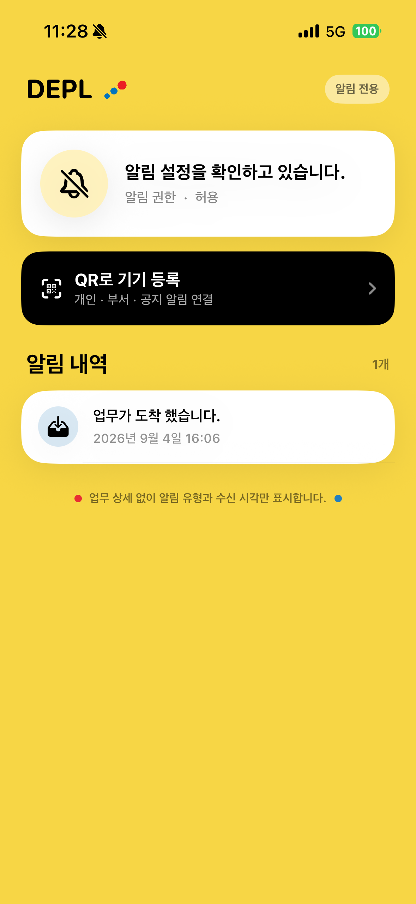
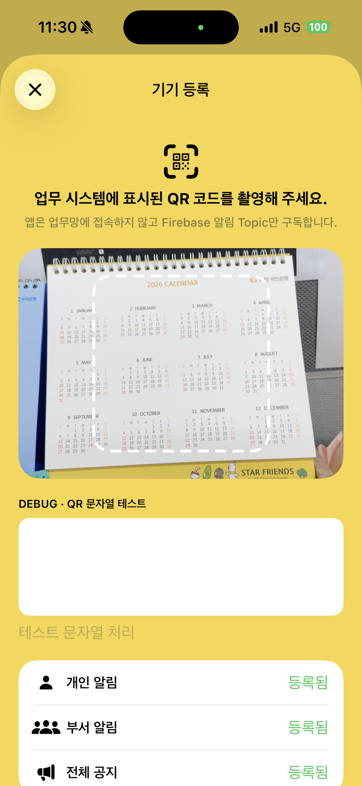
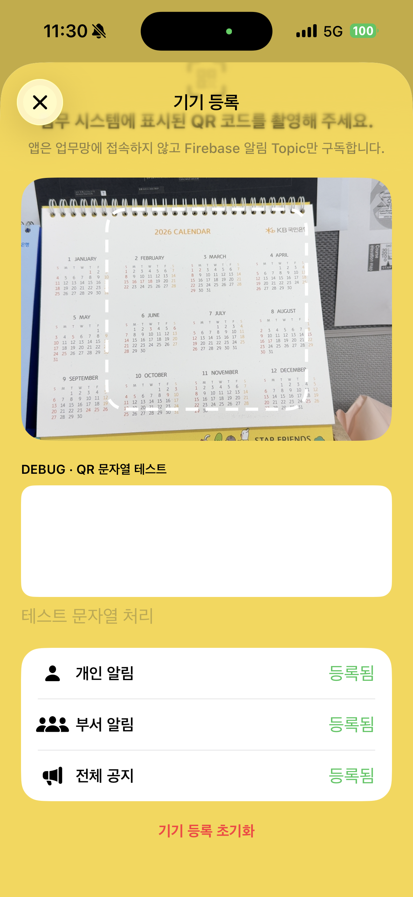

# DEPL iPhone User Guide

## Getting started

Register using a QR code, then review notifications saved on your iPhone.

### 1. Connect and allow notifications

Open the company-provided DEPL app and connect to Wi-Fi or mobile data. Allow notifications when prompted. The app uses the internet; it does not connect directly to the Gateway on your company's private network.

### 2. Open device registration

Tap the black “QR로 기기 등록” button (Register device with QR). This opens registration for personal notifications, department notifications and company-wide announcements. You will need a QR code issued for you by the business system.

### 3. Review notification history

“알림 내역” means Notification history. It shows saved messages and their recorded times. The number on the right is the number of saved entries. Scroll to view older entries. Use the business system to view or act on the underlying work item.

### Permission does not mean registration is complete

“알림 권한 · 허용” means Notification permission: allowed. The captured “알림 설정을 확인하고 있습니다.” message means the app is checking its notification setup, not that registration has completed. Check all three subscription categories on the registration screen as well.

<!-- pagebreak -->

## Register with a QR code

Display your QR code in the business system and scan it using DEPL on your iPhone.

### 1. Obtain a current QR code

Ask the business system to issue a QR code for your own user account and actual department. Do not use another person's QR code or share a screenshot of yours.

### 2. Scan the entire code

Allow camera access if prompted. Fit the entire QR code inside the white guide, avoid glare and adjust the distance if necessary. Wait while the app validates the code and subscribes to notifications.

### 3. Request a new code if it expires

The current default validity period is 3 minutes, with a maximum of 10 minutes. Your company's issuance settings may differ. If the code has expired, request a new one and scan again. Keep the phone's date and time set correctly.

### Ignore the DEBUG input box

These screenshots show a development build. “DEBUG · QR 문자열 테스트” is a QR-text test field for developers. Regular users should use the camera, not enter text in that field.

<!-- pagebreak -->

## Check registration status

Check personal notifications, department notifications and company-wide announcements together.

### 1. Confirm all three categories

For a new registration, look for “기기 등록이 완료되었습니다.” (Device registration is complete) and a success indicator for every category. Existing registrations may show “등록됨” (Registered), as in this screenshot. Do not treat partial success as completion.

### 2. Return and check delivery

Tap X at the top left to return to the main screen. Ask an administrator to send a test notification to you. Check the system notification and DEPL's in-app history separately.

### 3. Changing department or phone

Ask an administrator for a new QR code and register again. Do not tap “기기 등록 초기화” (Reset device registration) just to inspect your status or troubleshoot a screen.

### Resetting removes notification subscriptions

A registration reset is not a refresh. It unsubscribes the device from its existing notification topics. Once the reset completes, you must register with a QR code again to continue receiving those notifications.

<!-- pagebreak -->

## History and troubleshooting

A notification appearing on the Lock Screen is not the same as an entry being saved inside DEPL.

### Up to 3,000 saved entries; no server history sync

The current source code retains the latest 3,000 entries and removes older entries beyond that limit. Duplicate event IDs are not saved again. Pull-to-refresh reads local history only; it does not download past notifications from the Gateway. The app does not open work-item detail pages.

### Important iPhone limitation

Notifications are saved when the app handles them, such as when it receives one in the foreground or you tap a notification. Saving every notification displayed while the app is in the background or closed is not guaranteed. A missing history entry does not by itself prove that delivery failed. Contact your administrator about recovery options before deleting the app.

### Camera unavailable

Check DEPL's camera permission in iPhone Settings.

### Expired QR code or signature error

Request a new QR code. If the error persists, ask your administrator to confirm that the company app and QR code use matching settings.

### Setup remains pending or registration fails

Check the internet connection and app version. Report the exact status message, the time of the failure and each subscription category's status to your administrator.

### No notification or sound

Check notification permission, Lock Screen settings, Focus, silent mode and all three registration categories. If a system notification has no matching history entry, open the app or tap that notification to check; the iOS storage limitation may apply.

### Scope and safe support requests

Screenshots were captured directly from an iPhone 15 Pro on 10 September 2026. They show the installed build; storage behavior is described from the current source code. Versions may differ. No new registration, test send or reset was performed to make this guide. Provide your app version, error time and status text when requesting help. Never send QR contents or images, FCM tokens or private keys. The screenshots retain the original Korean interface; English button meanings are supplied in this guide.
